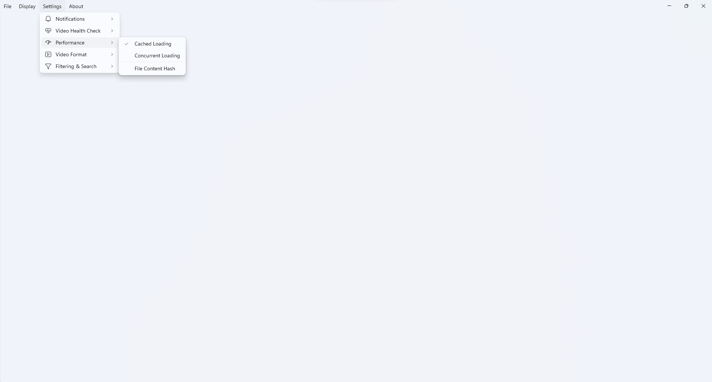
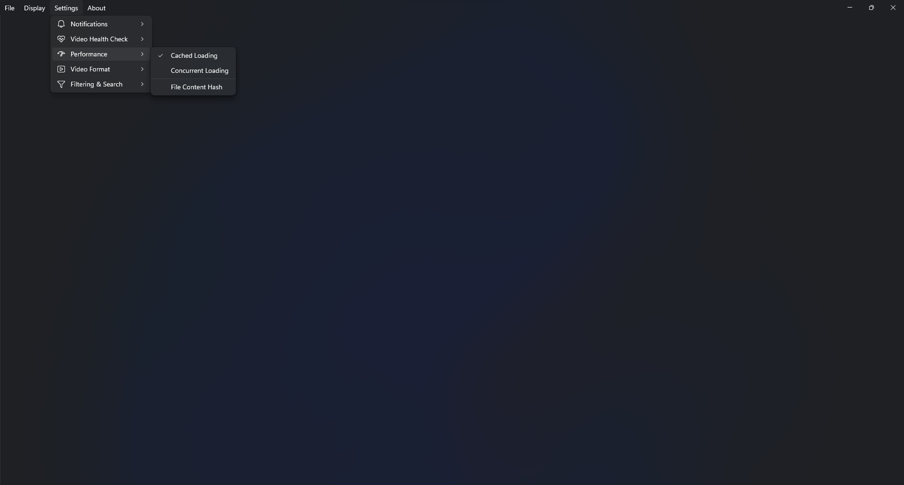
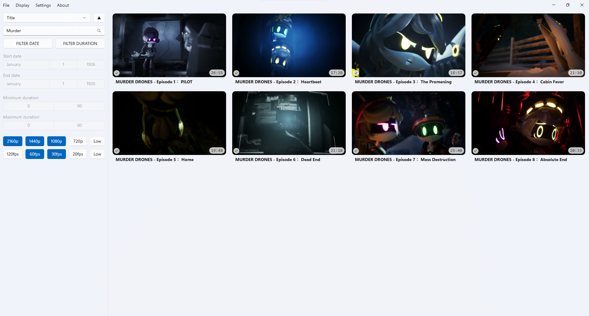
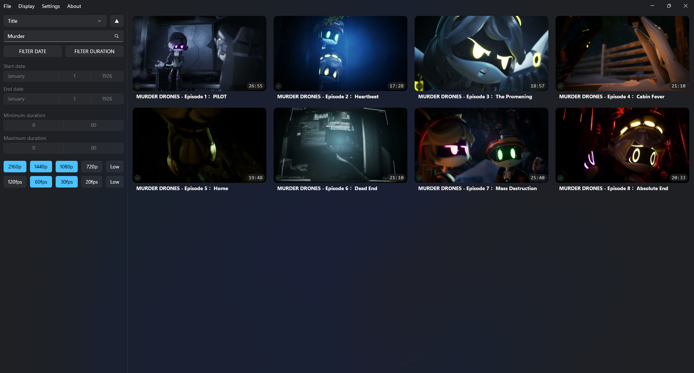
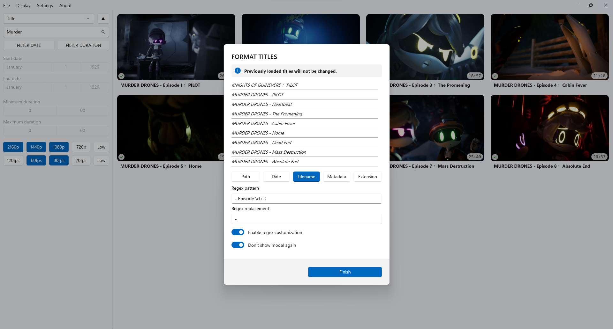
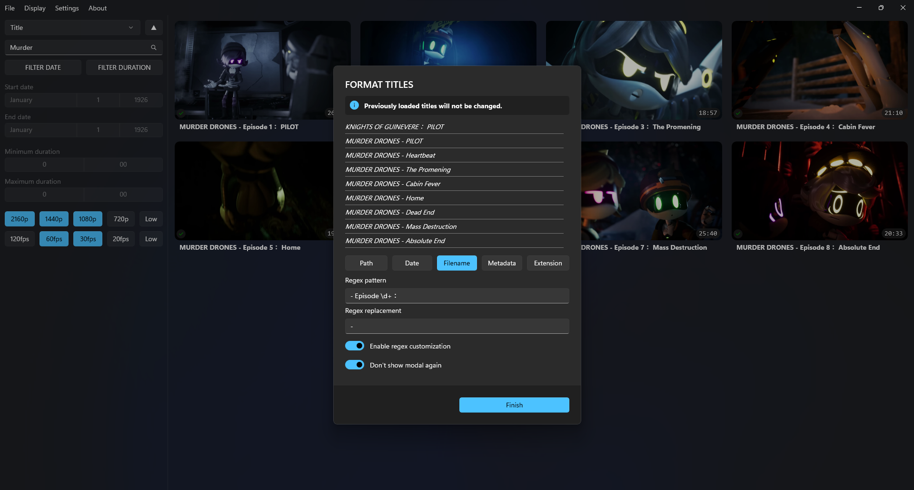

# VIDHUB

**VidHub** is a video collector, manager and organizer application designed for Windows using *WinUI 3* with *.NET 8.0*, focused on efficient loading, detailed organization, and a highly customizable viewing experience.

---

[![License][license-badge]][license-link]
[![Release][release-badge]][release-link]

[![Build][build-badge]][build-link]
[![Issue][issue-badge]][issue-link]

---

## Overview

VidHub is a modern Windows application designed to provide a structured and efficient way to manage video collections. It emphasizes clarity, performance, and consistency.

The application offers a streamlined workflow for adding, browsing, and reviewing videos through a clean and responsive interface. Visual previews and adaptable layouts support quick navigation, while the overall design remains focused and unobtrusive.

Built with WinUI 3 and .NET 8.0, VidHub aligns with Windows system conventions and appearance settings to deliver a cohesive and reliable desktop experience.

## Features

### Video Collecting & Loading

- Load initialization via file picker, drap & drop or clipboard
- Video collecting and loading simultaneously
- Collecting and loading progress displaying
- Optional parallel video loading and cached data reloading
- Video hashing based on file path or file content for caching
- Video metadata extraction
- Periodic health check for videos based customizable health level check

### Organizing (Ordering & Filtering)

- Order videos by *title*, *duration*, *creation date*, *resoltuion* or *framerate*
- Filter videos by *title*, *duration*, *creation date*, *resoltuion* or *framerate*
- Filter video titles with optional *case sensitivity*, *suggestions for titles* and *live search*

### Display & Customization

- Grid video displaying with adjustable grid sizes
- Preview image displaying with optional *title*, *creation date*, *duration*, *video health*, *resolution* and *framerate* showcase
- Preview image *absolute*- and *relative* position configuration with optional *embedded image extraction*
- Batch title customization with optional *file path*, *creation date* and *metadata* information
- Light and dark theme support based on system settings
- Context menu for basic video *opening*, *copying*, *renaming* and *removing* operations

### Notification Services

- Automatically updating notifications
- Notifications for video health results
- Notifications for required software detection and installation option
- Notifications for large cache storage size and cleanup option
- *Bar*- and *system* notifications and taskbar interactions

## Screenshots

| Description | Light Mode | Dark Mode |
| :--- | :---: | :---: |
| Empty view with side panel |  |  |
| Multiple layered menu bar |  |  |
| Loading videos with progress indicator |  |  |
| Loaded videos without side panel |  |  |
| Filtered videos |  |  |
| Changed video size |  |  |
| Title customization modal |  |  |

## License

This project is licensed under [MIT License](LICENSE.txt).

[license-link]: https://github.com/MarkLehoczky/VidHub/blob/main/LICENSE.txt
[release-link]: https://github.com/MarkLehoczky/VidHub/releases
[build-link]:   https://github.com/MarkLehoczky/VidHub/actions
[issue-link]:   https://github.com/MarkLehoczky/VidHub/issues

[license-badge]: https://img.shields.io/github/license/MarkLehoczky/VidHub?style=for-the-badge&color=success
[release-badge]: https://img.shields.io/github/v/release/MarkLehoczky/VidHub?include_prereleases&sort=date&display_name=tag&style=for-the-badge&color=success
[build-badge]:   https://img.shields.io/github/actions/workflow/status/MarkLehoczky/VidHub/build.yml?style=for-the-badge
[issue-badge]:  https://img.shields.io/github/issues/MarkLehoczky/VidHub?style=for-the-badge
