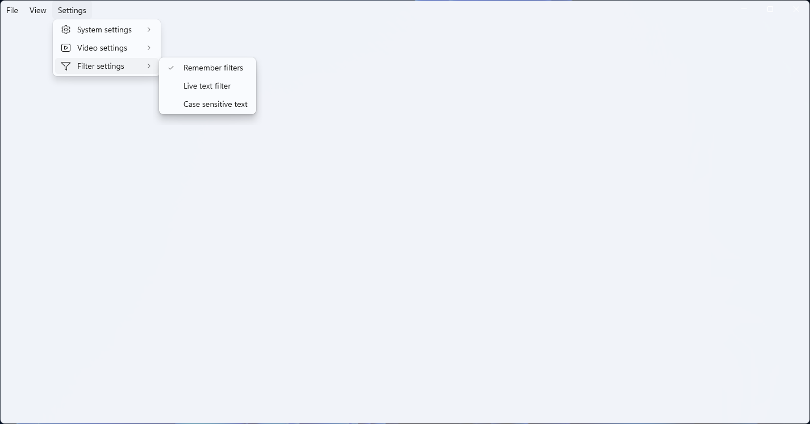
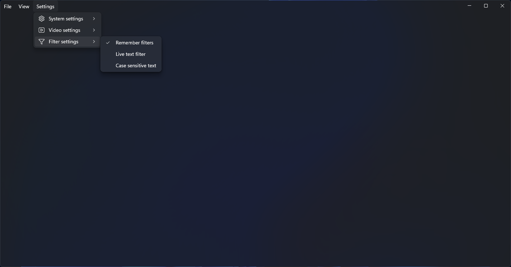
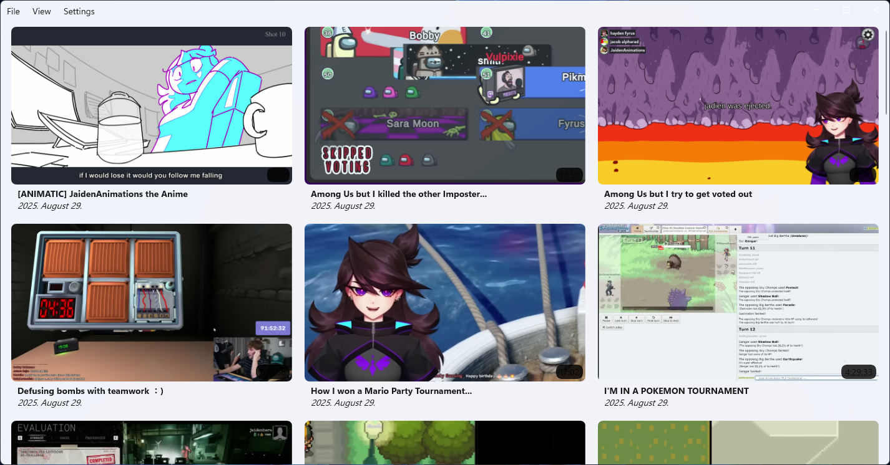
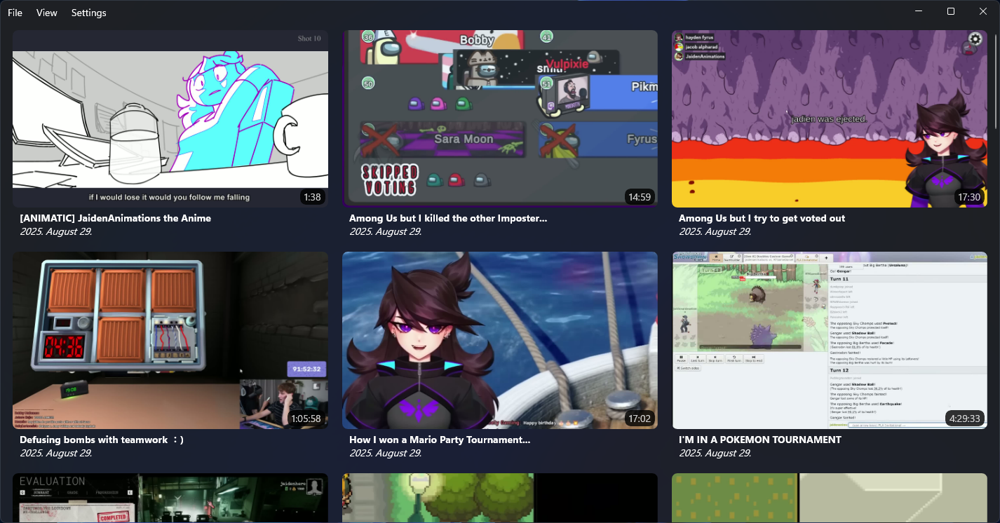
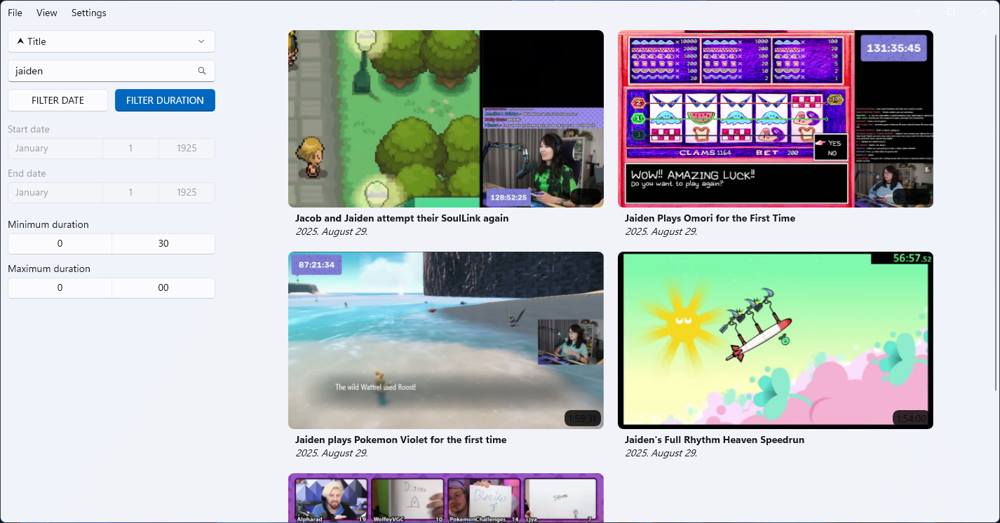
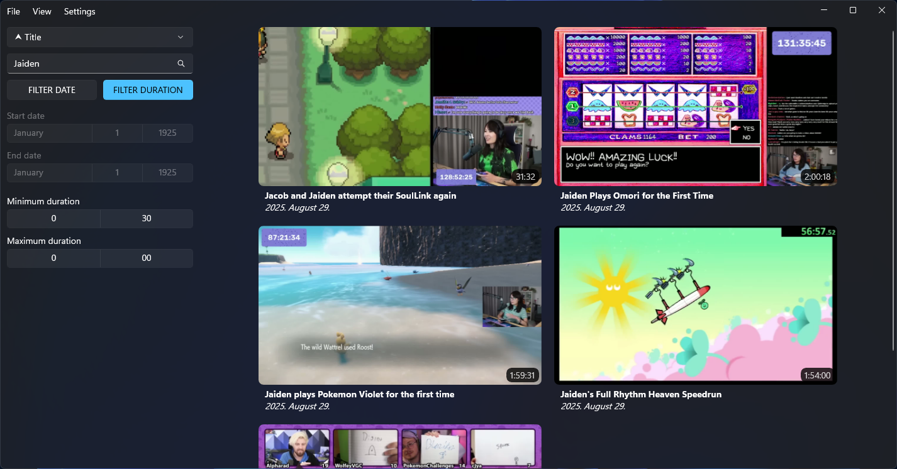
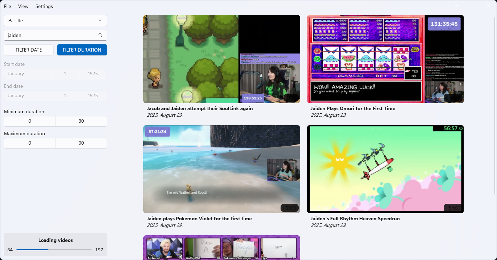
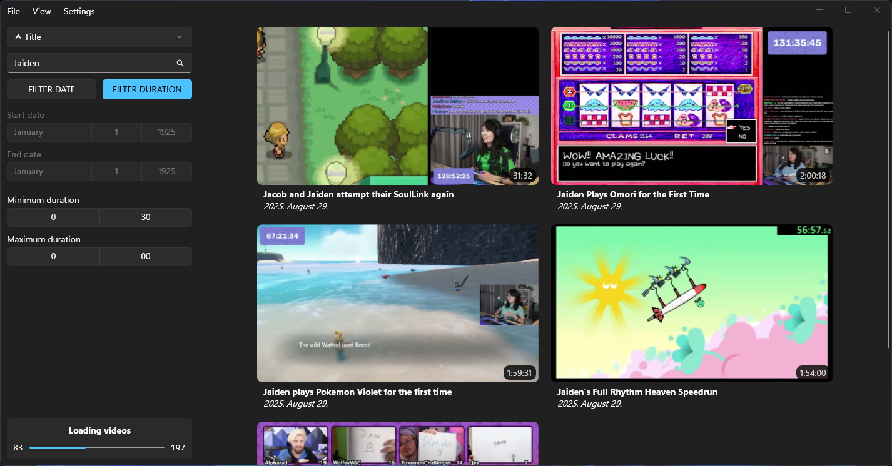

# VIDHUB

**VidHub** is a video collector and organizer application designed for Windows using *WinUI 3* with *.NET 8.0*.

---

[![License][license-badge]][license-link]
[![Release][release-badge]][release-link]

[![Build][build-badge]][build-link]
[![Issue][issue-badge]][issue-link]

---

## Features

### 🖥️ UI-Focused Features

- 🖥️ **Video Display UI** – Display loaded videos in an intuitive interface
- 📂 **Drag & Drop Video Loading** – Add videos by dragging files into the app
- 📋 **Clipboard Video Loading** – Load videos directly from clipboard URLs
- 📁 **File/Folder Picker Video Loading** – Use a picker dialog to load videos from files or folders
- 🔢 **Sorting & Filtering** – Organize content using basic sort and filter options
- 🔍 **Text Filter Settings** – Filter videos or items based on text input
- 🔄 **Transfer Displaying** – Basic UI for displaying ongoing transfers

### ⚡ Core Functionality

- ⚙️ **Settings Persistence** – Keep set values for settings and optionally for filters and sorter
- 🗄️ **Cached Loading** – Enable cached loading for improved performance
- 🎥 **Concurrent Video Loading** – Load multiple videos simultaneously
- 📌 **Taskbar Status Interactions** – Show status and interactions directly from the taskbar
- 🔔 **System Notifications** – Get alert notifications for important events
  
## Screenshots

| Description                         |                                Light Mode                                 |                                Dark Mode                                 |
| :---------------------------------- | :-----------------------------------------------------------------------: | :----------------------------------------------------------------------: |
| Empty view with w/o side panel      |          |          |
| Loaded videos w/o side panel        |        |        |
| Filtered videos w/ side panel       |  |  |
| Active video loading                |                  |                  |

## License

This project is licensed under [MIT License](LICENSE.txt).

[license-link]: https://github.com/MarkLehoczky/VidHub/blob/main/LICENSE.txt
[release-link]: https://github.com/MarkLehoczky/VidHub/releases
[build-link]:   https://github.com/MarkLehoczky/VidHub/actions
[issue-link]:   https://github.com/MarkLehoczky/VidHub/issues

[license-badge]: https://img.shields.io/github/license/MarkLehoczky/VidHub?style=for-the-badge&color=success
[release-badge]: https://img.shields.io/github/v/release/MarkLehoczky/VidHub?include_prereleases&sort=date&display_name=tag&style=for-the-badge&color=success
[build-badge]:   https://img.shields.io/github/actions/workflow/status/MarkLehoczky/VidHub/build.yml?style=for-the-badge
[issue-badge]:  https://img.shields.io/github/issues/MarkLehoczky/VidHub?style=for-the-badge
